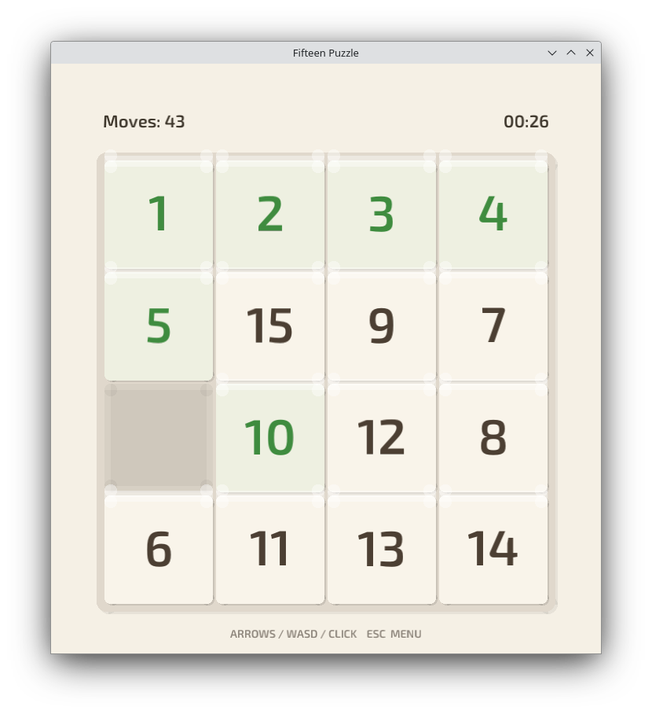

# Fifteen Puzzle

A classic sliding tile puzzle with warm, tactile visuals. Built with Rust and [macroquad](https://github.com/not-fl3/macroquad).


## Features

- 3x3 to 6x6 grid sizes
- Guaranteed solvable puzzles
- Multi-tile sliding (click any tile on the same row/column as the empty cell)
- Move counter and timer
- Best score tracking per session
- Keyboard (WASD / arrows) and mouse controls
- Sound effects (Kenney.nl assets)
- Adjustable volume
- Resizable window with auto-scaling board

## Screenshot



## Building

### Prerequisites

- [Rust](https://rustup.rs/) (stable)
- Linux: `libasound2-dev libx11-dev libxi-dev libgl1-mesa-dev`

### Quick build

```bash
cargo build --release
```

The binary will be at `target/release/fifteen-game`.

### Cross-platform builds

Install build tools first:

```bash
make setup
```

Then build all targets:

```bash
make all        # linux binary + .deb + .rpm + windows .exe
make linux-bin  # just the linux binary
make linux-deb  # debian package
make linux-rpm  # rpm package
make windows    # windows .exe (via mingw-w64)
```

macOS (requires native runner or osxcross):

```bash
make mac        # x86_64
make mac-arm    # aarch64
```

### CI/CD

GitHub Actions workflow at `.github/workflows/build.yml` builds all targets automatically. Push a tag like `fifteen-v0.1.0` to create a release.

## Controls

| Action | Keys |
|--------|------|
| Move tile | WASD / Arrow keys / Mouse click |
| Navigate menus | WASD / Arrow keys |
| Select | Enter / Space / Mouse click |
| Back / Menu | Escape |

## License

[MIT](LICENSE.md)

## Credits

- Font: [Exo 2](https://fonts.google.com/specimen/Exo+2) by Natanael Gama (OFL)
- Sound effects: [Kenney.nl](https://kenney.nl/) (CC0)
- Game framework: [macroquad](https://github.com/not-fl3/macroquad)
